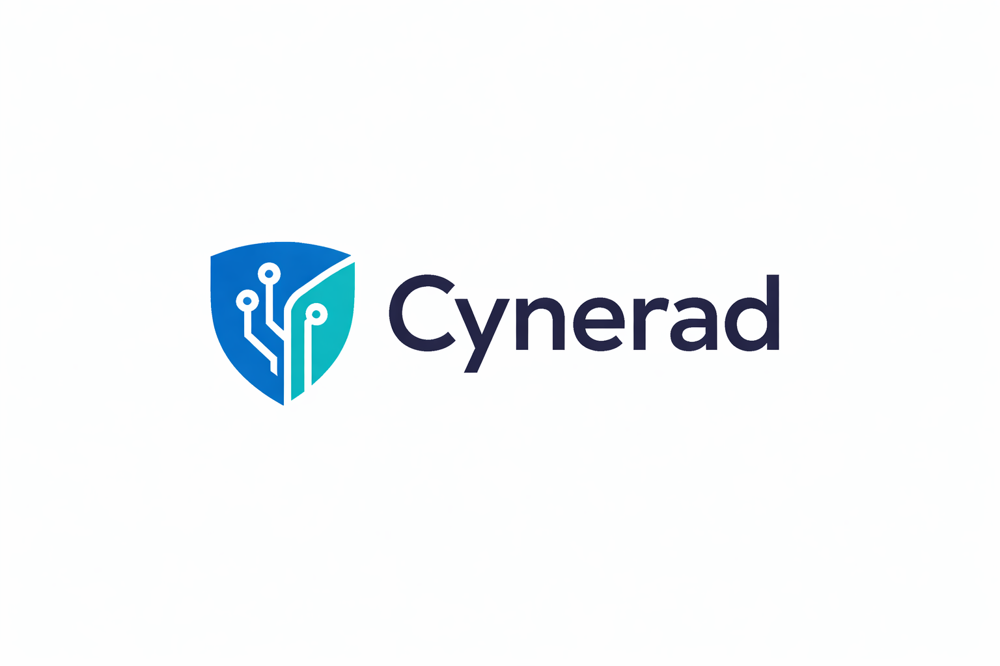

# @cynerad/hooks

Collection of hooks for react projects.

<p align="center">
  
</p>

## Overview

`@cynerad/hooks` is a collection of hooks for react projects.

- **Docs**: [example.com/docs](https://example.com/docs)
- **Changelog**: [CHANGELOG.md](./.changeset/README.md)

---

## Installation

```bash
# Install from npm
npx shadcn@latest add https://cynerad.github.io/hooks/public/r/hooks.json

# install from pnpm
pnpm dlx shadcn@latest add https://cynerad.github.io/hooks/public/r/hooks.json

# install from yarn
yarn shadcn@latest add https://cynerad.github.io/hooks/public/r/hooks.json

# install from bun
bun x shadcn@latest add https://cynerad.github.io/hooks/public/r/hooks.json

```

---

## Features

- **use-battery** : Track the device battery level and charging status.
- **use-boolean** : Manage a boolean state with helpful toggle helpers.
- **use-copy-to-clipboard** : Copy text to the clipboard easily.
- **use-countdown** : Create and control a countdown timer.
- **use-counter** : Manage a numeric counter with increment/decrement functions.
- **use-debounce** : Delay a value update until after a specified time.
- **use-default** : Use a default value when the main value is undefined or null.
- **use-document-title** : Set and update the browser document title.
- **use-event-listener** : Attach and clean up event listeners easily.
- **use-favicon** : Change the website favicon dynamically.
- **use-fetch** : Fetch data from an API with loading and error state handling.
- **use-geo-location** : Get the user’s current geographic location.
- **use-history-state** : Sync state with browser history.
- **use-hover** : Detect when an element is hovered.
- **use-idle** : Detect user inactivity (idle state).
- **use-in-viewport** : Check if an element is visible in the viewport.
- **use-intersection-observer** : Observe element visibility using Intersection Observer API.
- **use-interval** : Run a function repeatedly at a set interval.
- **use-is-client** : Detect if code is running on the client side.
- **use-is-first-render** : Detect if the component is rendering for the first time.
- **use-is-mobile** : Detect if the user is on a mobile device.
- **use-is-mounted** : Check if a component is mounted.
- **use-key-press** : Detect specific key press events.
- **use-list** : Manage an array with add, remove, and update helpers.
- **use-local-storage** : Store and sync state with localStorage.
- **use-lock-body-scroll** : Lock or unlock body scrolling.
- **use-logger** : Log component lifecycle or state changes for debugging.
- **use-long-press** : Detect long press interactions on elements.
- **use-map** : Manage a Map object with helper methods.
- **use-measure** : Measure element dimensions (width, height, etc.).
- **use-media-query** : Match and react to CSS media queries.
- **use-mouse** : Track mouse position and movement.
- **use-network-state** : Monitor network connection status and type.
- **use-on-mount** : Run a function once when the component mounts.
- **use-orientation** : Detect screen orientation changes.
- **use-page-leave** : Detect when the user leaves the page.
- **use-preferred-language** : Get the user’s preferred browser language.
- **use-previous** : Store and access the previous value of a state or prop.
- **use-queue** : Manage a queue data structure in state.
- **use-render-count** : Count how many times a component renders.
- **use-render-info** : Get detailed information about component renders.
- **use-resize-observer** : Observe element size changes using Resize Observer API.
- **use-script** : Dynamically load and manage external scripts.
- **use-session-storage** : Store and sync state with sessionStorage.
- **use-set** : Manage a Set object with helper methods.
- **use-sound** : Play and control audio sounds easily.
- **use-step** : Manage step-based navigation (like a wizard).
- **use-throttle** : Limit how often a function runs over time.
- **use-timeout** : Run a function after a specified delay.
- **use-toggle** : Toggle between two states easily.
- **use-visibility-change** : Detect when the page visibility changes.
- **use-window-scroll** : Track window scroll position.
- **use-window-size** : Track window width and height.

---

## Testing

This package uses [Vitest](https://vitest.dev).

```bash
# Run tests (uses "vitest run" under the hood)
pnpm test

# Run Vitest in watch/dev mode
pnpm dev
```

Scripts (from `package.json`):

- **`pnpm dev`** – run Vitest in watch mode.
- **`pnpm test`** – run the full Vitest test suite once.

---

## Contributing

- Fork the repository.
- Create a feature branch.
- Make your changes with tests.
- Run `pnpm lint` and `pnpm test`.
- Open a Pull Request.

By contributing, you agree that your contributions will be licensed under the same **[MIT License](./LICENSE.md)** as this project.
